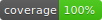

# PinApp Challenge



A Flutter application demonstrating the use of repositories to fetch posts and comments from a REST API and a native integration using Pigeon. The app uses BLoC for state management and supports multiple environments (development, staging, and production).

> A Spanish version of this README is available [here](README.es.md).

[▶ Watch Video](https://drive.google.com/file/d/16pBPPZZtOXpD0ujZ4PfkzMZr9mFTUDvv/view)

## Features

- Displays a list of posts with details (title, body).
- Shows comments for a selected post.
- Integration with native platforms (iOS and Android) for fetching comments.
- Environment-specific configuration for API endpoints.

## Architecture

- **Posts Repository**: Handles fetching posts from a JSON REST API.
- **Comments Repository**: Uses a native integration (via Pigeon) to fetch comments.
- **BLoC Pattern**: Manages state for posts (`PostListCubit`) and post comments (`PostCommentsCubit`).
- **Multi-Repository Provider**: Provides repositories to the widget tree.
- **Native Code**: Kotlin and Swift implementations for the comments API.

## Getting Started

### Prerequisites

- Flutter SDK installed on your machine.
- An IDE (Visual Studio Code, Android Studio, etc.) with Dart/Flutter support.
- For native code modifications, ensure you have Xcode for iOS and Android Studio for Android.

### Installation

1. Clone the repository:

   ```bash
   git clone https://github.com/tomassasovsky/pinapp_challenge
   cd pinapp_challenge
   ```

2. Install dependencies:

   ```bash
   flutter pub get
   ```

### Running the App

The app supports development, staging, and production configurations.

- **Development**

  ```bash
  flutter run -t lib/main_development.dart
  ```

- **Staging**

  ```bash
  flutter run -t lib/main_staging.dart
  ```

- **Production**

  ```bash
  flutter run -t lib/main_production.dart
  ```

### Building for iOS and Android

For iOS:

```bash
open ios/Runner.xcworkspace
```

For Android, open the project in Android Studio or run:

```bash
flutter build apk
```

### Testing

To run tests, execute:

```bash
flutter test
```

## Folder Structure

```
.
├── lib
│   ├── app
│   │   └── app.dart         # Main application widget
│   ├── bootstrap.dart       # App bootstrap and error handling
│   ├── l10n                 # Localization files
│   ├── post_comments
│   │   ├── cubit
│   │   │   ├── post_comments_cubit.dart
│   │   │   └── post_comments_state.dart
│   │   └── view
│   │       └── post_comments_view.dart
│   ├── post_list
│   │   ├── cubit
│   │   │   ├── post_list_cubit.dart
│   │   │   └── post_list_state.dart
│   │   └── widget
│   │       └── post_widget.dart
│   └── main_development.dart
│   └── main_staging.dart
│   └── main_production.dart
├── packages/posts_repository         # Posts repository package
└── packages/comments_repository      # Comments repository package
```

## Posts Repository

For information on the posts repository, see the [Posts Repository README](packages/posts_repository/README.md).

## Comments Repository

For information on the comments repository, see the [Comments Repository README](packages/comments_repository/README.md).

## License

This project is licensed under the MIT License. See [LICENSE](LICENSE) for details.
